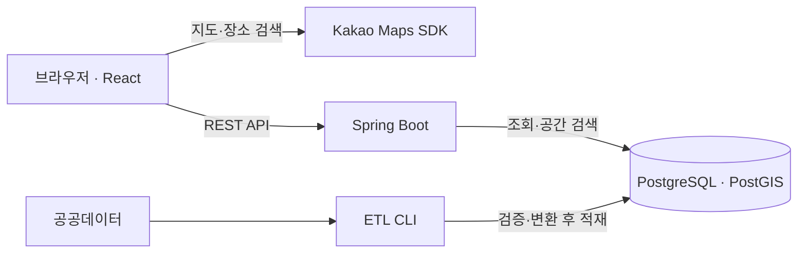

# 여기 창업해도 돼? - RecycleYoungs

## 프로젝트 소개

**RecycleYoungs는 서울의 창업 후보지를 공공데이터로 탐색하고 비교하는 서비스입니다.** 현재 MVP는 카페 업종을 지원합니다. 앞으로 지원 업종과 상권 분석 기능을 넓힐 계획입니다.

**목차**

- [프로젝트 소개](#프로젝트-소개)
- [화면 미리보기](#화면-미리보기)
- [주요 기능](#주요-기능)
- [서비스 이용 흐름](#서비스-이용-흐름)
- [기술 스택](#기술-스택)
- [시스템 아키텍처](#시스템-아키텍처)
- [공공데이터](#공공데이터)
- [REST API](#rest-api)
- [프로젝트 구조](#프로젝트-구조)
- [빠른 시작](#빠른-시작)
- [테스트 및 CI](#테스트-및-ci)
- [상세 기술 문서](#상세-기술-문서)

## 화면 미리보기

주요 기능을 실제 서비스 화면 이미지와 함께 소개할 예정입니다.

## 주요 기능

| 기능           | 설명                                                                                              |
| -------------- | ------------------------------------------------------------------------------------------------- |
| 지도 탐색      | 서울의 자치구와 행정동을 선택해 경계를 확인하고, 현재 지도 영역의 카페 위치와 기본 정보를 봅니다. |
| 지역·장소 검색 | 구·동 필터로 지역을 고르거나 장소명·지하철역·주소로 검색해 지도를 이동합니다.                     |
| 주변 카페 조회 | 지도에서 고른 지점이나 검색한 장소를 중심으로 500m 또는 1km 이내의 카페와 거리를 확인합니다.      |
| 상권 통계      | 선택한 자치구나 행정동 전체의 카페 점포·추정매출과 지역 전체 유동인구를 확인합니다.               |
| 후보지 비교    | 최대 3곳을 등록해 같은 반경의 경쟁 카페 수와 각 후보지가 속한 행정동의 상권 통계를 비교합니다.    |

같은 행정동에 속한 후보지에는 동일한 상권 통계가 표시됩니다. 주변 카페는 각 후보지의 좌표를 중심으로 조회합니다.

## 서비스 이용 흐름

1. 홈에서 탐색을 시작한 뒤 관심 지역을 선택하거나 장소를 검색합니다.
2. 지도 영역의 카페를 살펴보고, 관심 지점을 고르면 반경 안의 카페와 거리를 확인할 수 있습니다.
3. **상권 분석**에서 선택한 구·동의 점포, 추정매출, 유동인구를 봅니다.
4. 지도나 검색 결과에서 후보지를 추가하고 **후보지 분석**에서 주변 경쟁 환경과 소속 행정동 통계를 나란히 봅니다.

## 기술 스택

| 영역         | 기술                                                                                      |
| ------------ | ----------------------------------------------------------------------------------------- |
| Frontend     | React, React Router, TypeScript, Vite, Tailwind CSS, shadcn/ui, Kakao Maps JavaScript SDK |
| Backend      | Java 21, Spring Boot 4, Spring MVC, Spring JDBC, Gradle                                   |
| 데이터베이스 | PostgreSQL, PostGIS, Flyway                                                               |
| ETL          | Node.js 24, TypeScript, Zod, node-postgres                                                |
| 실행 및 검증 | Docker Compose, GitHub Actions CI, Vitest, Playwright, JUnit, Testcontainers              |

## 시스템 아키텍처

브라우저는 Kakao Maps SDK로 지도를 표시하고 Spring Boot REST API로 상권 데이터를 조회합니다. 백엔드는 PostgreSQL의 게시 데이터를 읽고 PostGIS로 경계·반경·지도 영역을 판정합니다. 별도 CLI로 실행하는 ETL은 공공데이터를 검증하고 변환해 DB에 적재합니다.


```mermaid
flowchart LR
    FE["브라우저 · React"] -->|지도·장소 검색| MAP["Kakao Maps SDK"]
    FE -->|REST API| API["Spring Boot"]
    API -->|조회·공간 검색| DB[("PostgreSQL · PostGIS")]
    DATA["공공데이터"] --> ETL["ETL CLI"]
    ETL -->|검증·변환 후 적재| DB
```

로컬 개발 환경과 GitHub Actions CI를 제공합니다. VPS용 `docker-compose.prod.yml`은 Nginx·Certbot·GitHub Actions CD와 함께 구현할 계획입니다. [배포 계획](docs/development.md#배포-검토-항목)

## 공공데이터

| 제공처                                                                                     | 활용 데이터                                                |
| ------------------------------------------------------------------------------------------ | ---------------------------------------------------------- |
| [서울 열린데이터광장](https://data.seoul.go.kr/)                                           | 행정동 경계, 자치구·행정동별 점포·추정매출·길단위인구 통계 |
| [소상공인시장진흥공단 상가(상권)정보 API](https://www.data.go.kr/data/15012005/openapi.do) | 공공데이터포털에서 제공하는 카페 위치·업종·점포 정보       |

자치구 통계는 공식 자치구 원천을 직접 사용합니다. 원본 수집·검증·적재는 ETL 명령으로 실행하며 정기 자동 갱신은 아직 운영하지 않습니다. 원본 출처와 실행법은 [ETL 가이드](docs/etl-guide.md), 로컬 적재·재실행 결과는 [ETL 검증·적재 이력](docs/archive/etl-validation-history.md)에 있습니다.

2026-11-17 기존 개발 DB에 서울시 API 통계 6종을 통합했습니다. 자치구·행정동의 점포, 추정매출, 유동인구 총 410,731행의 게시 출처와 수치를 검증했습니다. 새로 클론해 만든 DB에는 게시 데이터가 자동으로 생성되지 않습니다. [개발 DB 게시 데이터](docs/development.md#개발-db-게시-데이터)

## REST API

`db` 프로필에서 행정동·자치구의 경계와 통계를 모두 조회할 수 있습니다. 표의 각 경로 앞에 `/api/v1`을 붙여 `GET`으로 요청합니다.

| 조회                   | 경로                                                                                                                      | 쿼리 파라미터                                                                                |
| ---------------------- | ------------------------------------------------------------------------------------------------------------------------- | -------------------------------------------------------------------------------------------- |
| 행정구역 목록·경계     | `/districts`<br>`/districts/{districtCode}/dongs`<br>`/districts/{districtCode}/boundary`<br>`/dongs/{dongCode}/boundary` | 없음                                                                                         |
| 반경과 겹치는 행정구역 | `/regions/nearby`                                                                                                         | 필수 `longitude`, `latitude` · 선택 `radiusM`, `districtCodes`                               |
| 점포 통계              | `/districts/{districtCode}/stats/stores`<br>`/dongs/{dongCode}/stats/stores`                                              | 필수 `quarterCode`, `industryCode`                                                           |
| 추정매출 통계          | `/districts/{districtCode}/stats/sales`<br>`/dongs/{dongCode}/stats/sales`                                                | 필수 `quarterCode`, `industryCode`                                                           |
| 유동인구 통계          | `/districts/{districtCode}/stats/foot-traffic`<br>`/dongs/{dongCode}/stats/foot-traffic`                                  | 필수 `quarterCode`                                                                           |
| 주변 카페              | `/cafes/nearby`                                                                                                           | 필수 `longitude`, `latitude` · 선택 `radiusM`, `districtCodes`, `limit`, `offset`            |
| 지도 영역 카페         | `/cafes/viewport`                                                                                                         | 필수 `west`, `south`, `east`, `north` · 선택 `districtCodes`, `dongCodes`, `limit`, `offset` |

요청 조건과 응답 형식은 [데이터 설계](docs/data-design.md#행정구역-rest-api-계약)에 정리했습니다.

## 프로젝트 구조

```text
RecycleYoungs/
├── frontend/              # React 웹 앱
├── backend/               # Spring Boot API와 Flyway 마이그레이션
├── etl/
│   └── src/
│       ├── index.ts       # CLI 진입점
│       ├── cli/           # 인자 파싱, 도움말, 명령 실행
│       ├── common/        # 환경설정, DB, CSV, 서울시 API 공통 처리
│       ├── domains/       # 경계, 업종, 카페, 점포, 매출, 유동인구
│       └── workflows/     # 공식 원본 통합 사전검증
├── docs/                  # 서비스·데이터·개발 문서
└── docker-compose.yml     # 로컬 개발 DB와 선택형 전체 스택
```

## 빠른 시작

`project-upgrade`를 체크아웃한 새 클론에서 아래 실행 방식 중 하나를 선택합니다. 호스트에서 Frontend·Backend를 실행하려면 Node.js 24 LTS·npm 11과 Java 21을 준비합니다. 하이브리드와 전체 Docker는 Docker Compose가 필요합니다. [팀원 클론과 실행 방식](docs/development.md#팀원-클론과-실행-방식)

### DB 없이 웹 앱과 백엔드 실행

`frontend/.env.example`을 참고해 `frontend/.env.local`에 `VITE_KAKAO_MAP_APP_KEY`를 설정하고 Kakao Developers에 `http://localhost:5173`을 등록합니다. 키가 비어 있으면 앱에 지도 설정 안내가 표시됩니다. [Kakao Maps 설정](docs/development.md#kakao-maps-설정)

저장소 루트에서 프론트엔드를 실행합니다.

```bash
cd frontend
nvm use
npm ci
npm run dev
```

별도 터미널의 저장소 루트에서 백엔드를 실행합니다.

```bash
cd backend
./gradlew bootRun
```

[홈](http://localhost:5173)과 [탐색 화면](http://localhost:5173/explore)은 프론트엔드에서 열 수 있습니다. 백엔드는 기본적으로 `localhost:8080`에서 기동하며, 지역·상권 데이터 조회에는 DB 연결과 게시 데이터가 필요합니다.

### 로컬 DB와 조회 API 실행

하이브리드 방식은 PostGIS만 Docker로 실행하고, Frontend는 Vite HMR, Backend는 Gradle로 호스트에서 실행합니다. 루트 `.env`를 준비하고 DB 이름·계정·포트·JDBC URL이 로컬 개발 DB를 가리키는지 확인합니다. `cp -n`은 기존 파일을 유지합니다.

```bash
cp -n .env.example .env
```

기본 백엔드가 실행 중이면 종료한 뒤 저장소 루트에서 실행합니다.

```bash
docker compose -f docker-compose.yml config --quiet
docker compose -f docker-compose.yml up -d --wait db
docker compose -f docker-compose.yml ps db
set -a
source .env
set +a
cd backend
./gradlew bootRun --args='--spring.profiles.active=db'
```

Frontend는 앞 절과 동일하게 실행합니다. `db` 프로필은 Flyway로 스키마를 적용합니다. 조회용 게시 데이터는 별도로 준비합니다. 호스트 서버는 실행한 터미널에서 `Ctrl+C`로 종료하고, DB는 `docker compose -f docker-compose.yml stop db`로 중지합니다. [환경변수 예시와 로컬 DB 준비](docs/development.md#로컬-db-준비)

### 전체 Docker 스택 실행

저장소 루트에서 `.env`를 준비한 뒤 `full` 프로필을 실행합니다. 기본 `recycleyoungs` 프로젝트는 하이브리드 방식과 같은 `recycleyoungs_postgres_data` 볼륨을 사용합니다. 실지도가 필요하면 빌드 전에 루트 `.env`의 JavaScript 키와 실제 접속 주소를 설정합니다. [Kakao Maps 설정](docs/development.md#kakao-maps-설정)

```bash
cp -n .env.example .env
docker compose -f docker-compose.yml --profile full config --quiet
docker compose -f docker-compose.yml --profile full up -d --build
docker compose -f docker-compose.yml --profile full ps
```

[Docker 홈](http://127.0.0.1:8081/)과 [탐색 화면](http://127.0.0.1:8081/explore)은 Nginx가 제공하고 `/api`는 내부 Spring Boot로 전달됩니다. `stop`으로 볼륨을 유지하며 종료하고 `start`로 같은 컨테이너를 다시 시작할 수 있습니다. Frontend만 재빌드하거나 두 환경의 볼륨을 분리하는 명령은 [전체 Docker 스택](docs/development.md#전체-docker-스택)에 있습니다.

## 테스트 및 CI

로컬에서는 `frontend/`와 `etl/`에서 각각 `npm test`, `npm run lint`, `npm run format:check`, `npm run build`를 실행합니다. `backend/`에서는 `./gradlew build`를 실행하며, `./gradlew integrationTest`는 Docker의 일회용 PostGIS를 사용합니다.

GitHub Actions는 `project-upgrade`에 Push하거나 이 브랜치를 대상으로 PR을 열거나 갱신할 때 다음 5개 Job을 실행합니다. [CI 워크플로](.github/workflows/ci.yml) · [개발 가이드의 CI 설명](docs/development.md#github-actions-ci)

| Job                 | 검증 범위                                                       |
| ------------------- | --------------------------------------------------------------- |
| Frontend            | 린트·포맷·Vitest·제품 빌드                                      |
| Frontend E2E        | E2E 타입·모의 API 검사와 Playwright Chromium 사용자 흐름 테스트 |
| Backend             | Gradle 테스트·Spotless·Spring Boot JAR 빌드                     |
| Backend integration | Testcontainers의 일회용 PostGIS로 통합 테스트                   |
| ETL                 | 린트·포맷·기본 Vitest 테스트와 빌드                             |

## 상세 기술 문서

| 문서                                                                                                                                       | 내용                                        |
| ------------------------------------------------------------------------------------------------------------------------------------------ | ------------------------------------------- |
| [서비스 명세](docs/service-spec.md)                                                                                                        | 탐색·비교 동작과 서비스 정책                |
| [데이터 설계](docs/data-design.md)                                                                                                         | DB 모델·Flyway·게시 배치·REST API 계약      |
| [ETL 가이드](docs/etl-guide.md) · [검증·적재 이력](docs/archive/etl-validation-history.md)                                                 | 원본 출처, 검증·적재 명령, 체크섬·게시 이력 |
| [개발 가이드](docs/development.md)                                                                                                         | 환경변수, 로컬 실행, 테스트, 배포 계획      |
| [자치구 통계 정책](docs/data-design.md#공식-자치구-통계와-집계-정책) · [전분기 비교 검증](docs/archive/quarter-comparison-verification.md) | 공식 원천과 집계 기준, 분기 간 비교 근거    |
